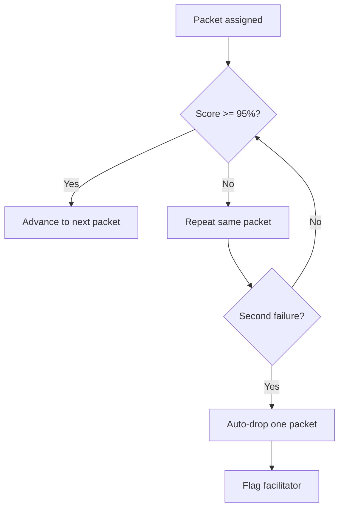
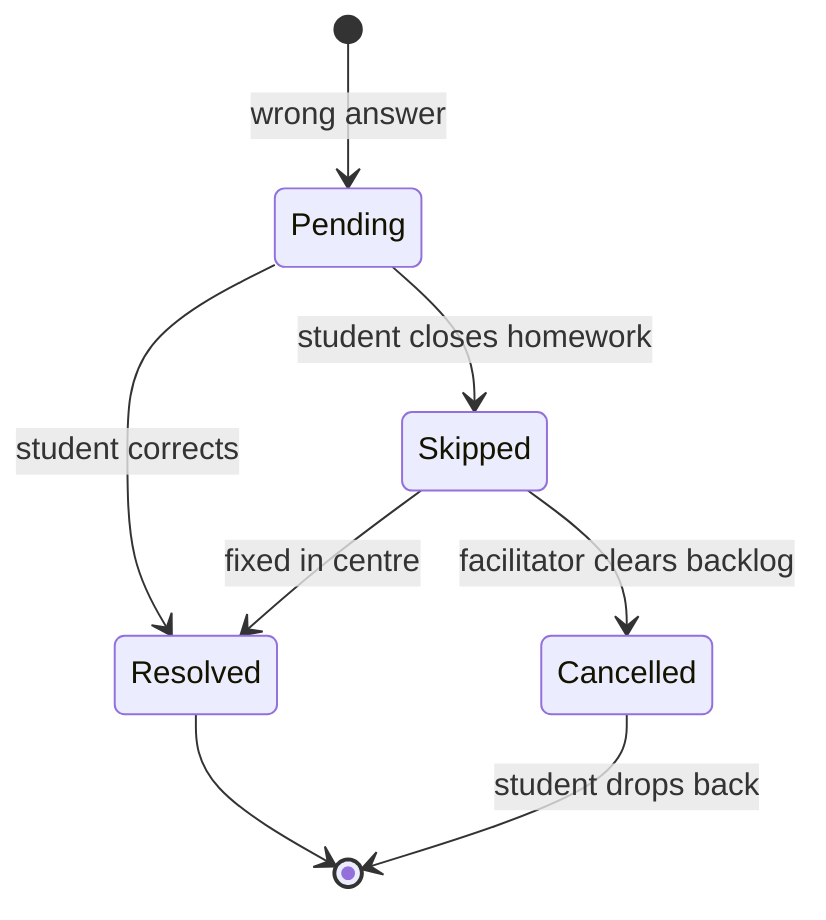

# MathLogic — Product Spec v0.1

Last updated 2026-09-16.

## Overview

A digital replacement for the Kumon worksheet model: students work on lent iPads with Apple Pencil, handwriting is recognised and graded automatically, and parents get a nightly report on what their child actually did.

The bet is that traditional centres are labour-heavy — six or seven assistants grading paper — and give parents almost no visibility into the five days a week of home practice. Automating grading collapses the labour cost. Capturing digital ink produces data no paper centre can match.

Positioning is high quality and modestly cheaper than Kumon's roughly $200/month, not a discount product. The differentiator is transparency.

Sequencing: build for one owned centre, prove the model, then license the software to independent operators for a per-student royalty. Licensing is the real business; the owned centre is the proving ground.

Kumon's worksheets are copyrighted. The pedagogical structure — small increments, daily repetition, speed-and-accuracy advancement — is not. All problem content must be independently authored.

## Curriculum structure

Pages are fixed and canonical, not dynamically generated. Page numbering is the spine of the system: instructors reason in page numbers, parents track progress by them, and a repeated page must contain the same problems so the student gets faster rather than getting new work.

Problems are authored once using templates, then frozen. The generator stays available for optional extra practice outside the numbered sequence.

| Unit | Contains | Notes |
| --- | --- | --- |
| Level | ~200 pages | Equivalent to Kumon's 7A–Q progression |
| Packet | 10 or 5 pages, set per student | The unit of assignment and repetition |
| Page | N problems | Frozen once authored |
| Problem | Prompt + correct answer | Position within page is fixed |

The packet is the unit of work: students are assigned, graded, advanced and demoted by packet, not by page. Packet size is a property of the student, not the level, so a packet cannot be a fixed row in the curriculum. Pages and problems stay canonical; the packet boundary is assigned at runtime from the student's current position and their current packet size.

### Sizing rule

A student on 10-page packets who consistently exceeds 45 minutes drops to 5 pages. A student on 5-page packets who consistently finishes under 20 minutes returns to 10.

Those thresholds are 4.5 and 4.0 minutes per page, so there is a dead band between them and a student near the boundary will not oscillate week to week.

Timing is accumulated active working time on the packet, not wall clock and not session count. A 10-page packet that exceeds 45 minutes by definition spans more than one session, so the measure has to accumulate. Active time counts pen-down time plus gaps under about 90 seconds, which keeps a bathroom break out of the number.

"Consistently" means three consecutive packets. Two reacts to a bad day; four is too slow to help.

Only in-centre packets drive resizing. Homework conditions are uncontrolled — interruptions, dinner, a child wandering off mid-packet — so homework timing is recorded but does not trigger a size change.

## Data model

Two invariants matter more than the rest: attempts are never overwritten, and raw ink is stored permanently. See `schema.sql` for the implementation.

| Entity | Key fields |
| --- | --- |
| students | name, DOB, parent contacts, enrolment date, current level, current page, current packet size, assigned tablet |
| levels | name, order, description, default packet size for new students |
| packets | student, level, start page, page count, assigned_at — generated at runtime, not curriculum |
| pages | level, page number |
| problems | page, position, prompt, correct answer, answer shape |
| attempts | student, packet, attempt number, started_at, submitted_at, status, location, active_seconds |
| answers | attempt, problem, raw ink strokes, recognised value, confidence, verdict, time spent, instructor override |
| corrections | student, answer, created_at, skipped_at, resolved_at, cancelled_at |
| recognition_corrections | student, answer, system_read, actual_value, timestamp |
| handwriting_profiles | student, calibrated_at, per-digit bias weights |
| legibility_notes | student, digit, observation, date |
| student_events | student, kind, from/to level and page, triggered_by |

**Attempts are append-only.** A student hitting the same packet three times produces three rows, each with its own timing and score. This is what makes "three attempts, 40% faster each time" possible in a parent report. Any code path that updates a graded attempt is a bug, and the schema blocks it with a trigger.

**Raw ink is permanent.** Store the stroke data, not just the recognised digit. Recognition models improve, and you will want to re-grade history against a better one. More importantly, ink plus `recognition_corrections` is a labelled corpus of children's handwritten digits that no competitor starting fresh will have.

`recognition_corrections` does triple duty: it feeds per-student recognition tuning, generates legibility feedback for parents, and accumulates training data.

## Handwriting recognition

Capture is digital ink — stroke data from the pencil, not a photo of a page. Stroke data carries direction, order, pressure and timing, and is substantially more accurate than scanning. Candidate engines: MyScript iink and Mathpix's digital ink API.

Most answers are short numbers rather than expressions, which is the easy end of the problem.

**Recognition is server-side only.** Because a student cannot submit while offline, there is no need for on-device recognition, and no correct answers are ever stored on the tablet. Offline work is captured as ink with a timestamp and graded on sync. This removes the cheating surface and a substantial amount of client complexity.

**Calibration.** A one-time exercise on the student's first day: write 0 through 9, establishing a baseline profile. The profile then updates passively from confirmed answers, so it tracks handwriting as it matures rather than staying frozen at day one.

**Per-student adaptation.** Every instructor override writes to `recognition_corrections`. Over weeks this builds a profile of that student's quirks, and the recogniser is biased accordingly — if their 4 reads ambiguously and their history says 4, weight toward 4. Correction rate per student should fall over time, which directly reduces instructor workload.

**Confidence threshold.** Tunable, and worth watching closely in the first month. Correction rate is the number that determines whether one facilitator can cover a class of 30 or is pushed back into being a grader.

## Grading rules

Grading is on the final answer only. Working — carry marks, intermediate products, remainders — is captured as ink but not graded. Keeping the ink means work-analysis can be added later without re-collecting data.

| Verdict | Student sees | Next |
| --- | --- | --- |
| Correct | Normal progression | — |
| Wrong | "Wrong" | Goes to corrections |
| Illegible | "Unable to read work" | Rewrite |

A correct answer in messy handwriting must never be presented the same way as a wrong answer. A child told only "try again" will assume the maths was wrong and change a correct answer. The illegible message says the writing could not be read, not that the answer was incorrect.

**Rewrite ceiling: two attempts.** If the second rewrite is also illegible, the system accepts what is there, writes a legibility note, and moves on. No child gets stuck in a loop at bedtime.

**Legibility notes** are recorded per digit and surfaced to parents as guidance — for example, that the child's 4s need work. They never affect the maths score. Legibility is tracked as its own metric over time.

## Advancement and demotion

Advancement gate is 95% accuracy. Failing twice drops the student back a packet automatically — the system decides, not the instructor.

The flag tells the facilitator to go and sit with the student and teach — it is not a request for a decision. Removing decision latency keeps the facilitator teaching rather than administering.

**The gate is measured per hundred problems, not per packet.** Because packet size tracks student speed, a 5-page packet goes to the slowest students rather than the most advanced. Applying 95% to the packet would put the strictest gate on exactly the children who are struggling: five pages of six problems allows one wrong answer, while ten pages of twenty allows ten.

Allowed wrong answers are the problem count times 0.05, rounded up, with a minimum of one: 100 problems allows 5, 30 allows 2, 20 allows 1. Rounding up rather than down keeps short packets from becoming the harshest.

**Time standard.** Kumon advances on speed as well as accuracy. A standard completion time per level cannot be borrowed — it has to come from your own data. Version one grades on accuracy alone and accumulates timing for roughly six months before a time standard is switched on.

**Repeated demotion is a distinct signal.** One drop is a bad week; two or three in a short window means placement is wrong. Both demotion paths — packet failure and cleared corrections backlog — write to `student_events` so the pattern is visible, and repeated drops escalate to a parent conversation rather than another flag.

## Corrections

Corrections are a persistent per-student queue, not a property of an attempt. They survive across days, accumulate, and are cleared at the next in-centre session.

**Skipping is allowed and visible.** A student can close homework with corrections outstanding. The skip is logged and appears in that night's parent email. Nothing disappears quietly, and no child is trapped at bedtime.

**In-centre, corrections come first.** On arrival the student clears outstanding corrections before new material.

**Backlog is read as a signal, not managed.** If corrections have piled up, the facilitator can cancel the whole backlog. Doing so means the student was not ready for the material, and they drop back a packet. This is the second demotion path.

**Skip rate is worth surfacing independently of scores.** Three nights of skipped corrections means either the level is too hard or the student has disengaged — either way the facilitator should know before the backlog forces the issue.

## Homework

The schedule is two in-centre sessions of ~45 minutes plus homework on the remaining days — assume three homework days per week.

The tablet downloads upcoming packets while on wifi. A student can write offline but cannot submit: the work is stored locally with its timestamp and graded when the device reconnects. No feedback, no corrections and no scoring happen offline, and work that has not synced by 8:30pm misses that night's email.

**Online is requested and is the default.** When connected, work is graded and returned immediately. Illegible answers are flagged for rewrite in the same session; wrong answers go to the corrections queue.

**Closing homework.** Homework closes at 100% — every answer correct and legible. The student can also close with corrections outstanding, which logs a skip and surfaces in the parent email. Outstanding corrections are done at the start of the next day's work, alongside the new packet.

The two thresholds are deliberate: homework requires 100% to close because practice is corrected until perfect, while 95% is the gate for advancing a packet.

**Homework integrity is out of scope for now.** Ink timing could detect an adult doing the work or five days completed in one sitting, but flagging it is not a v1 behaviour. The data is captured regardless, so the option stays open.

## Parent notifications

One email per night at 8:30pm, covering that day, whether centre or home. This is the single parent touchpoint — no per-event notifications, so nothing gets tuned out.

Contents:

- Packet worked and pages completed
- Score, and what was got wrong
- Time taken
- Corrections outstanding or skipped
- Legibility notes, framed as guidance rather than a grade

**Days with no work still get an email.** "No work completed today" is arguably the most valuable message the system sends, and precisely what a paper centre cannot.

**Work after 8:30pm** rolls into the next night's email and must be dated honestly — "completed 11:15pm last night", not implied as same-day.

**Instructor review before send, initially.** A misrecognised digit telling a parent their child failed something they got right is a trust problem that does not recover quickly. Version one queues the report for a brief facilitator glance. Once confidence data is solid, the send goes fully automatic.

## Accounts and login

The parent holds the account. No six-year-old manages credentials, and the parent's login is what gives access to reports and history.

The app needs two modes. A parent unlocks into student mode and hands the tablet over; the child must not be left sitting inside the parent view with scores and reports in it.

**In centre, students check in with a QR badge card** held up to the tablet camera. Nothing to read, nothing to memorise, and a five-year-old can manage it. The scan also assigns the tablet, so the roster on the facilitator console fills itself. Cards are cheap to reprint, and a child who forgets theirs is checked in manually from the console.

A picture password was the alternative. It was rejected because thirty children in one room means the sequence is visible to whoever is sitting next to them, and because there is nothing to hand back when a family leaves.

At home the parent unlocks into student mode once per session rather than per packet, so a child can finish a sitting without fetching an adult, but cannot wander into the parent view later.

## Centre operations

One facilitator per session, 25–30 students. The facilitator teaches and handles flagged students; the system grades. Sessions are ~45 minutes, twice weekly per student.

**Facilitator console.** Live view of the room: who is seated, who started when, current packet, and — most importantly — alerts. Stuck for four minutes, sudden speed drop, second failure, correction backlog. Alerts are what make 30 students manageable by one person; without them the facilitator is scanning rather than reacting.

**Waiting-room screen.** Deliberately high level: name, status (in progress, under review, finishing up), and rough time. No levels, no page numbers, no percentages. Parents' actual question is how much longer, and publicly displaying levels invites comparison between children.

No student-facing classroom screen. Progress is already on the student's own tablet.

**Tablets are lent, not sold.** Lending keeps the pen, screen size and app version controlled, which keeps recognition accuracy predictable. Cost is inventory and breakage, assume ~10% annually. A family that leaves must return the tablet or be charged replacement cost plus 10%, which is far easier to collect as a card-on-file authorisation taken at enrolment than as an invoice to a family that has already gone. It belongs in the enrolment agreement.

**Device management: start with Apple's own, free.** Apple Business launched on 14 April 2026 with a built-in management service at no cost, replacing Apple Business Manager and Apple Business Essentials. It covers enrolment, configuration profiles, app distribution and baseline restrictions — the entire requirement for a single-purpose, locked-down iPad.

Move to a third-party MDM only when policy needs scoping by group or compliance state. Mosyle is the usual small-fleet recommendation, but its free tier caps at 30 devices and paid tiers carry a 30-licence minimum, so a second centre crosses that line immediately. SimpleMDM publishes flat pricing at $2.50–$3.00 per device per month with no contract.

Enrolment: buy iPads through a reseller linked to the Apple account so devices auto-enrol and supervise on first boot. The profile then pushes the app, locks the device into single-app mode, and disables the App Store, Safari and general camera access — the camera stays available inside the app for badge scanning.

Sources: [Apple MDM comparison](https://blog.scalefusion.com/best-apple-mdm/), [Jamf alternatives and pricing](https://www.appaloosa.io/blog/jamf-alternatives).

## Remaining work

- Curriculum content — format and early levels specified in `curriculum-templates.md`; 2A to be authored in full first
- Franchisee royalty, pencilled at $35, deferred until there is something to license
- Time standards, which need roughly six months of accumulated timing data before they can be set

## Build sequence

**The recognition test runs alongside the build, not before it.** Schema, backend, grading logic and curriculum authoring do not depend on which engine wins, so they start now.

The test still happens in week one, with however many children can be gathered — ten is enough to see a pattern. If children's handwriting breaks the recogniser at a rate that cannot be tuned away, the product does not work in its current shape. That answer is cheap in week one and expensive in month four.

**Version one is one level, end to end.** Build the complete loop: student logs in, gets a packet, writes with the pencil, submits, gets graded, parent gets the email. A solid loop for one level makes the remaining levels content authoring rather than engineering.

Included in v1:

- Student tablet app with ink capture and offline support
- Server-side recognition with confidence scoring
- Grading, corrections queue, advancement and auto-demotion
- Facilitator console with alerts and review queue
- Nightly parent email with pre-send review
- One authored level (2A)

Deferred:

- Time standards (needs ~6 months of data first)
- Work-analysis on intermediate steps
- Homework integrity detection
- Waiting-room display
- Remaining levels
- Multi-centre and franchisee tooling
